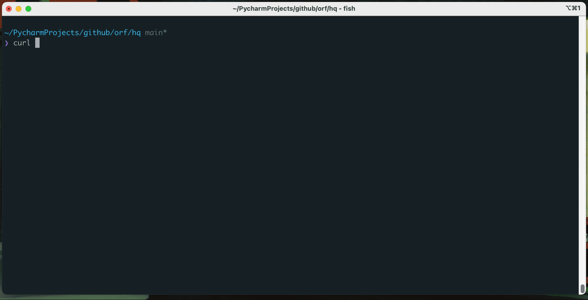

# hq

[](https://crates.io/crates/html-query)

jq, but for HTML. [Try it in your browser here](https://orf.github.io/hq/)



`hq` reads HTML and converts it into a JSON object based on a series of CSS selectors. The selectors are expressed
in a similar way to JSON, but where the values are CSS selectors. For example:

```
{posts: .athing | [ {title: .titleline > a, url: .titleline > a | @(href)} ] }
```

This will select all `.athing` elements, and it will create an array (`| [{...}]`) of objects for each element selected.
Then for each element it will select the text of the `titleline > a` element, and the `href` attribute (`| @(href)`).

The end result is the following structure:

```json
{
  "posts": [
    {
      "title": "...",
      "url": "..."
    }
  ]
}
```

## Install

`cargo install html-query`

## Examples

### Full hacker news story extraction

```
{posts: .athing | [{href: .titleline > a | @(href), title: .titleline > a, meta: @sibling(1) | {user: .hnuser, posted: .age | @(title) }}]}
```

This selects each `.athing` element, extracts the URL from the `href` attribute as well as the title. It then selects
the _sibling_ `.athing` element, and extracts the user and post time from that:

```json
{
  "posts": [
    {
      "title": "...",
      "url": "...",
      "meta": {
        "posted": "...",
        "user": "..."
      }
    }
  ]
}
```

## Special query syntax

### Selecting attributes

`.foo | @(href)`

This will select the `href` attribute from the first element matching `.foo`.

### Parents

`.foo | @parent`

This will return the parent element from the first element matching `.foo`.

### Siblings

`.foo | @sibling(1)`

This will return the sibling element from the first element matching `.foo`. 
